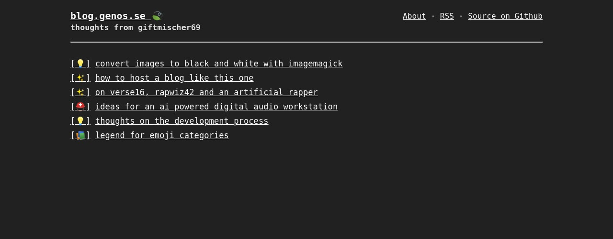

# lightning

forked from [bradleytaunt/lightspeed](https://github.com/bradleytaunt/lightspeed)

An opinionated, lightning fast and beautiful Jekyll theme.

screenshot:


live instance: [blog.genos.se](https://blog.genos.se)

-----

## Usage

````shell
# install
gem install jekyll bundler
bundle install

# run locally
bundle exec jekyll serve
````

## Author

[giftmischer69](https://github.com/giftmischer69/lightning)

<hr>

Author of [bradleytaunt/lightspeed](https://github.com/bradleytaunt/lightspeed):
**Bradley Taunt**
- <https://github.com/bradleytaunt>
- <https://twitter.com/bradtaunt>


## License

Open sourced under the [MIT license](LICENSE.md).

This project is open source except for example-of-all-elements article found in `_posts`.
